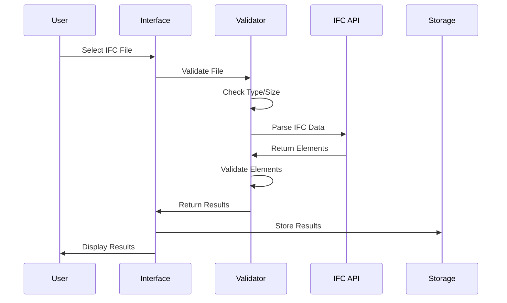

# System Architecture - BIMCheck

**Complete documentation of the BIMCheck system architecture, including components, technologies, and data flows.**

---

## 📋 Overview

**BIMCheck** is a modern web application developed for validating IFC (Industry Foundation Classes) files in Building Information Modeling (BIM) projects. The system uses a frontend-centric architecture with client-side processing, ensuring performance, scalability, and ease of maintenance.

---

## 🏗️ General Architecture

### **Architectural Pattern**
```
┌─────────────────────────────────────────────────────────────┐
│                    BIMCheck System                          │
├─────────────────────────────────────────────────────────────┤
│  Frontend Layer (Client-Side)                              │
│  ├── User Interface (HTML5/CSS3/JavaScript)                │
│  ├── IFC Processing (web-ifc)                              │
│  ├── Data Visualization (Chart.js)                         │
│  └── Report Generation (xlsx)                              │
├─────────────────────────────────────────────────────────────┤
│  Server Layer (Node.js)                                    │
│  ├── Static File Server                                    │
│  ├── CORS Management                                       │
│  └── MIME Type Handling                                    │
├─────────────────────────────────────────────────────────────┤
│  Data Layer (Local Storage)                                │
│  ├── Session Data                                          │
│  ├── Validation History                                    │
│  └── Dashboard Metrics                                     │
└─────────────────────────────────────────────────────────────┘
```

### **Main Characteristics**
- **Frontend-Centric**: Main processing on the client
- **Serverless Backend**: Minimal server to serve files
- **Local Storage**: Data persistence in browser
- **Modular**: Independent and reusable components
- **Responsive**: Interface adaptable to different devices

---

## 🎯 System Components

### **1. User Interface (UI Layer)**

#### **Main Page (index.html)**
```html
<!-- Main Structure -->
<header class="header">
  <h1>BIMCheck - IFC Validation System</h1>
</header>

<main class="main-content">
  <!-- File Upload Section -->
  <section class="upload-section">
    <input type="file" accept=".ifc" />
    <progress class="progress-bar"></progress>
  </section>
  
  <!-- Results Section -->
  <section class="results-section">
    <div class="summary-metrics"></div>
    <div class="problems-list"></div>
  </section>
  
  <!-- Examples Section -->
  <section class="examples-section">
    <button onclick="loadExample('valid_example.ifc')">Valid Example</button>
    <button onclick="loadExample('problematic_example.ifc')">Problematic Example</button>
  </section>
</main>
```

#### **Advanced Dashboard (dashboard.html)**
```html
<!-- Dashboard Structure -->
<header class="dashboard-header">
  <h1>BIMCheck Dashboard</h1>
  <nav class="dashboard-nav">
    <button onclick="navigateToMain()">Back to Main</button>
  </nav>
</header>

<main class="dashboard-content">
  <!-- Metrics Section -->
  <section class="metrics-section">
    <div class="metric-card">Total Elements</div>
    <div class="metric-card">Conformity Rate</div>
    <div class="metric-card">Critical Problems</div>
  </section>
  
  <!-- Charts Section -->
  <section class="charts-section">
    <canvas id="problemsChart"></canvas>
    <canvas id="elementsChart"></canvas>
  </section>
  
  <!-- Analysis Section -->
  <section class="analysis-section">
    <div class="conformity-analysis"></div>
    <div class="validation-history"></div>
  </section>
</main>
```

### **2. Business Logic Layer**

#### **Validation Engine (script.js)**
```javascript
// Main validation class
class BIMValidator {
  constructor() {
    this.ifcAPI = new WebIFC.IfcAPI();
    this.validationResults = [];
    this.dashboardData = {};
  }
  
  // File validation
  async validateFile(file) {
    const validations = [
      this.validateFileType(file),
      this.validateFileSize(file),
      this.validateFileIntegrity(file)
    ];
    
    return Promise.all(validations);
  }
  
  // IFC processing
  async processIFCFile(file) {
    const arrayBuffer = await file.arrayBuffer();
    const uint8Array = new Uint8Array(arrayBuffer);
    
    const modelID = this.ifcAPI.OpenModel(uint8Array);
    const elements = this.extractElements(modelID);
    
    return this.validateElements(elements);
  }
  
  // Element validation
  validateElements(elements) {
    return elements.map(element => ({
      id: element.expressID,
      type: element.type,
      material: this.validateMaterial(element),
      dimensions: this.validateDimensions(element),
      normCode: this.validateNormCode(element)
    }));
  }
}
```

#### **Report Generator**
```javascript
// Report generation class
class ReportGenerator {
  constructor(validationResults) {
    this.results = validationResults;
    this.workbook = XLSX.utils.book_new();
  }
  
  // Generate Excel report
  generateReport() {
    this.createSummarySheet();
    this.createDetailedProblemsSheet();
    this.createRecommendationsSheet();
    
    return this.workbook;
  }
  
  // Summary sheet
  createSummarySheet() {
    const summaryData = [
      ['Metric', 'Value'],
      ['Total Elements', this.results.totalElements],
      ['Valid Elements', this.results.validElements],
      ['Conformity Rate', `${this.results.conformityRate}%`],
      ['Critical Problems', this.results.criticalProblems]
    ];
    
    const worksheet = XLSX.utils.aoa_to_sheet(summaryData);
    XLSX.utils.book_append_sheet(this.workbook, worksheet, 'Summary');
  }
}
```

### **3. Web Server (server.js)**

#### **Node.js Static Server**
```javascript
const http = require('http');
const fs = require('fs');
const path = require('path');

class BIMCheckServer {
  constructor(port = 3000) {
    this.port = port;
    this.mimeTypes = {
      '.html': 'text/html',
      '.css': 'text/css',
      '.js': 'application/javascript',
      '.ifc': 'application/octet-stream',
      '.json': 'application/json'
    };
  }
  
  // Start server
  start() {
    const server = http.createServer((req, res) => {
      this.handleRequest(req, res);
    });
    
    server.listen(this.port, () => {
      console.log(`BIMCheck server running on http://localhost:${this.port}`);
    });
  }
  
  // Handle requests
  handleRequest(req, res) {
    const filePath = this.getFilePath(req.url);
    const mimeType = this.getMimeType(filePath);
    
    fs.readFile(filePath, (err, content) => {
      if (err) {
        this.handle404(res);
      } else {
        res.writeHead(200, {
          'Content-Type': mimeType,
          'Access-Control-Allow-Origin': '*'
        });
        res.end(content);
      }
    });
  }
}
```

---

## 🛠️ Technology Stack

### **Frontend Technologies**
```json
{
  "core": {
    "HTML5": "Structure and semantics",
    "CSS3": "Styling and responsive design",
    "JavaScript ES6+": "Business logic and interactions"
  },
  "libraries": {
    "web-ifc": "IFC file processing",
    "Chart.js": "Data visualization",
    "xlsx": "Excel report generation"
  },
  "frameworks": {
    "None": "Vanilla JavaScript for performance"
  }
}
```

### **Backend Technologies**
```json
{
  "runtime": {
    "Node.js": "JavaScript runtime environment"
  },
  "modules": {
    "http": "HTTP server",
    "fs": "File system operations",
    "path": "Path manipulation"
  },
  "dependencies": {
    "None": "Zero external dependencies"
  }
}
```

### **Development Tools**
```json
{
  "testing": {
    "Jest": "Unit testing",
    "Cypress": "E2E testing",
    "k6": "Performance testing"
  },
  "quality": {
    "ESLint": "Code linting",
    "Prettier": "Code formatting"
  },
  "build": {
    "npm": "Package management",
    "Node.js": "Build scripts"
  }
}
```

---

## 🔄 Data Flow

### **File Upload Flow**


### **Dashboard Data Flow**


---

## 🎨 Design Patterns

### **1. Modular Architecture**
```javascript
// Module pattern for organization
const BIMCheck = {
  // Core modules
  validator: new BIMValidator(),
  reporter: new ReportGenerator(),
  dashboard: new DashboardManager(),
  
  // Initialization
  init() {
    this.setupEventListeners();
    this.loadConfiguration();
    this.initializeComponents();
  }
};
```

### **2. Event-Driven Architecture**
```javascript
// Event system for component communication
class EventManager {
  constructor() {
    this.events = {};
  }
  
  on(event, callback) {
    if (!this.events[event]) {
      this.events[event] = [];
    }
    this.events[event].push(callback);
  }
  
  emit(event, data) {
    if (this.events[event]) {
      this.events[event].forEach(callback => callback(data));
    }
  }
}
```

### **3. Data Flow Pattern**
```javascript
// Unidirectional data flow
class DataFlowManager {
  constructor() {
    this.state = {};
    this.subscribers = [];
  }
  
  setState(newState) {
    this.state = { ...this.state, ...newState };
    this.notifySubscribers();
  }
  
  subscribe(callback) {
    this.subscribers.push(callback);
  }
  
  notifySubscribers() {
    this.subscribers.forEach(callback => callback(this.state));
  }
}
```

---

## ⚙️ System Configurations

### **Server Configuration**
```javascript
// server.js configuration
const config = {
  port: process.env.PORT || 3000,
  staticPath: path.join(__dirname, 'src'),
  corsEnabled: true,
  maxFileSize: '50mb',
  allowedOrigins: ['*'],
  mimeTypes: {
    '.html': 'text/html',
    '.css': 'text/css',
    '.js': 'application/javascript',
    '.ifc': 'application/octet-stream'
  }
};
```

### **Frontend Configuration**
```javascript
// Client-side configuration
const appConfig = {
  validation: {
    maxFileSize: 50 * 1024 * 1024, // 50MB
    allowedExtensions: ['.ifc'],
    supportedIFCVersions: ['IFC2X3', 'IFC4']
  },
  ui: {
    theme: 'glassmorphism',
    responsive: true,
    animations: true
  },
  storage: {
    type: 'localStorage',
    prefix: 'bimcheck_',
    expiry: 7 * 24 * 60 * 60 * 1000 // 7 days
  }
};
```

### **Validation Configuration**
```javascript
// Validation rules configuration
const validationConfig = {
  materials: {
    required: true,
    allowEmpty: false,
    validateProperties: true
  },
  dimensions: {
    minValue: 0.01,
    maxValue: 1000,
    validateProportions: true
  },
  normCodes: {
    required: true,
    supportedStandards: ['EN 1992-1-1', 'EN 14351-1'],
    strictMode: false
  }
};
```

---

## 📁 File Structure

### **Project Organization**
```
BIMCheck/
├── src/                          # Source files
│   ├── index.html               # Main page
│   ├── dashboard.html           # Advanced dashboard
│   ├── style.css               # Main styles
│   ├── dashboard.css           # Dashboard styles
│   ├── script.js               # Main logic
│   ├── dashboard.js            # Dashboard logic
│   └── examples/               # Example IFC files
│       ├── valid_example.ifc
│       ├── problematic_example.ifc
│       └── residential_project.ifc
├── tests/                      # Test files
│   ├── unit/                   # Unit tests
│   ├── e2e/                    # E2E tests (Cypress)
│   └── performance/            # Performance tests (k6)
├── docs/                       # Documentation
├── cypress/                    # Cypress configuration
├── server.js                   # Web server
├── package.json               # Dependencies
└── README.md                  # Project documentation
```

---

## 🔄 Processing Flows

### **IFC File Processing Flow**


### **Report Generation Flow**


---

## 🔧 Specific Components

### **1. Validation Engine**
```javascript
class ValidationEngine {
  constructor() {
    this.rules = new ValidationRules();
    this.processor = new IFCProcessor();
  }
  
  async validate(file) {
    // File validation
    const fileValidation = await this.validateFile(file);
    if (!fileValidation.valid) return fileValidation;
    
    // IFC processing
    const elements = await this.processor.extractElements(file);
    
    // Parameter validation
    const results = elements.map(element => ({
      id: element.id,
      type: element.type,
      problems: this.rules.validate(element)
    }));
    
    return this.generateReport(results);
  }
}
```

### **2. IFC Processor**
```javascript
class IFCProcessor {
  constructor() {
    this.api = new WebIFC.IfcAPI();
    this.api.SetWasmPath("./");
  }
  
  async extractElements(file) {
    const buffer = await file.arrayBuffer();
    const data = new Uint8Array(buffer);
    
    const modelID = this.api.OpenModel(data);
    
    const elements = [
      ...this.getElementsOfType(modelID, WebIFC.IFCWALL),
      ...this.getElementsOfType(modelID, WebIFC.IFCBEAM),
      ...this.getElementsOfType(modelID, WebIFC.IFCCOLUMN),
      ...this.getElementsOfType(modelID, WebIFC.IFCSLAB)
    ];
    
    return elements.map(element => this.processElement(modelID, element));
  }
}
```

### **3. Report Generator**
```javascript
class ReportGenerator {
  constructor() {
    this.templates = new ReportTemplates();
  }
  
  generateExcelReport(results) {
    const workbook = XLSX.utils.book_new();
    
    // Summary sheet
    const summary = this.createSummarySheet(results);
    XLSX.utils.book_append_sheet(workbook, summary, 'Summary');
    
    // Problems sheet
    const problems = this.createProblemsSheet(results.problems);
    XLSX.utils.book_append_sheet(workbook, problems, 'Detailed Problems');
    
    return workbook;
  }
}
```

---

## 🔒 Security and Performance

### **Security Measures**
- **File Validation**: Strict file type and size validation
- **Input Sanitization**: All user inputs are sanitized
- **CORS Configuration**: Controlled cross-origin requests
- **Local Processing**: No sensitive data sent to server
- **Client-Side Validation**: All processing done locally

### **Performance Optimizations**
- **Client-Side Processing**: Reduces server load
- **Local Storage**: Fast data persistence
- **Lazy Loading**: Components loaded on demand
- **Optimized Charts**: Efficient data visualization
- **Minimal Dependencies**: Reduced bundle size

---

## 📈 Scalability

### **Horizontal Scaling**
- **Static Files**: Can be served by CDN
- **Client Processing**: Scales with number of clients
- **Local Storage**: No database bottlenecks
- **Stateless Server**: Easy to replicate

### **Vertical Scaling**
- **Memory Efficient**: Minimal server memory usage
- **CPU Efficient**: Processing distributed to clients
- **Storage Efficient**: No server-side data storage
- **Network Efficient**: Minimal server communication

---

## 🔧 Maintenance and Monitoring

### **Monitoring Points**
- **File Upload Success Rate**: Track upload failures
- **Validation Performance**: Monitor processing times
- **Error Rates**: Track validation errors
- **User Interactions**: Monitor feature usage

### **Maintenance Tasks**
- **IFC Library Updates**: Keep web-ifc updated
- **Browser Compatibility**: Test across browsers
- **Performance Optimization**: Regular performance audits
- **Security Updates**: Keep dependencies updated

---

## 🎯 Architecture Benefits

### **✅ Advantages:**
- **Performance**: Fast client-side processing
- **Scalability**: Distributed processing load
- **Reliability**: No single point of failure
- **Maintainability**: Modular and organized code
- **Cost-Effective**: Minimal server requirements

### **✅ Technical Benefits:**
- **Responsive**: Works on all devices
- **Offline Capable**: Core functionality works offline
- **Fast Loading**: Minimal server dependencies
- **Secure**: Local data processing
- **Extensible**: Easy to add new features

---

**Document created by**: Joyce Fernandes  
**Email**: joyce.f.silva@hotmail.com  
**LinkedIn**: https://www.linkedin.com/in/joyce-fernandes-da-silva/  
**Date**: 20/08/2025  
**Version**: 1.0  
**Status**: ✅ System Architecture Documented and Functional